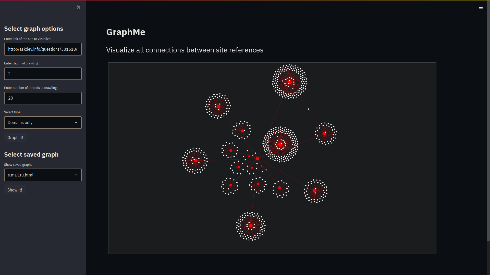
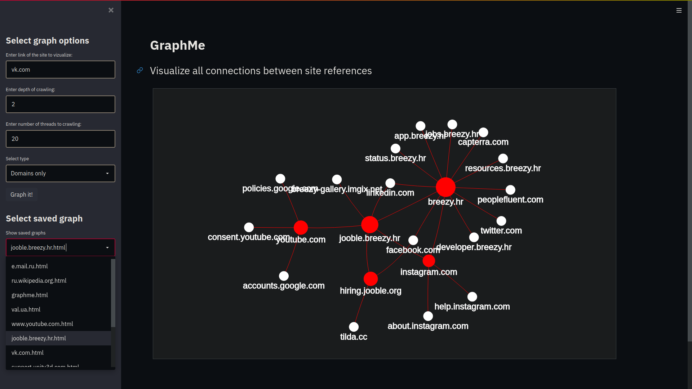

# GraphMe
### Crawl and visualize all connections between site references with certain depth of crawling.
[](https://share.streamlit.io/karazhyn/graphme/main.py)  <sup>Live version doesn't work for crawling new websites because host ip is mostly banned.</sup>

## Appearance



## Features
* Crawl all links in site with certain depth of recursion
* Visualize these links with interactive network graph
* Option to visualize full link\domain only
* Option to choose depth of crawling and number of threads to crawling
* Database with links to exclude from graph 
* Save and load graph

## Install and run
```
git clone https://github.com/karazhyn/graphme
cd graphme
pip install -r requirements.txt
python3 main.py
streamlit run main.py
```
 <sub>You can also use live version by this link [](https://share.streamlit.io/karazhyn/graphme/main.py) but it does not work for crawling new websites because host proxies are banned. Thus if you need full functionality it is better to run local application.</sup>
